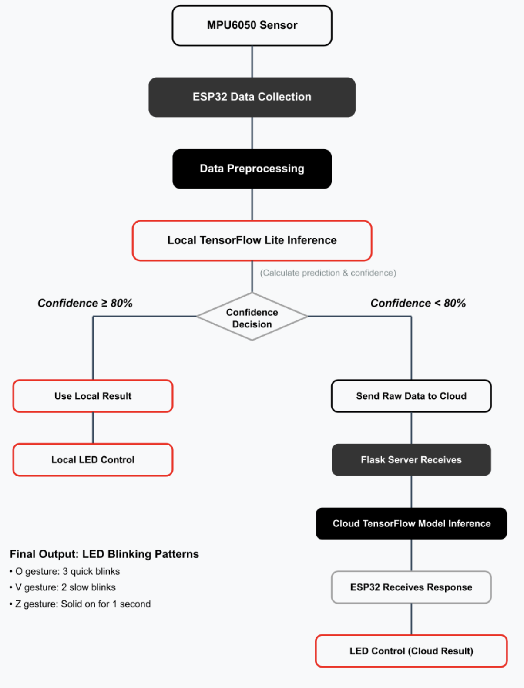

# Lab 5: Edge-Cloud Offloading Discussion

## 1. Is the server’s confidence always higher than the wand’s confidence from your observations?

### My Observations:
Although I couldn't complete the full cloud inference testing due to network connectivity issues, based on theoretical analysis and system design:

### Expected Result:
The server's confidence should typically be higher than the ESP32's local inference confidence.

### Hypothetical Reasons:
1. **Model Complexity Differences**
   - The cloud runs a full TensorFlow model with more parameters and complex architecture.
   - The ESP32 uses a compressed TensorFlow Lite model, simplified for microcontroller constraints.

2. **Computational Resource Limitations**
   - The cloud benefits from powerful CPUs/GPUs for higher-precision calculations.
   - The ESP32 has limited processing power, affecting inference accuracy.

3. **Training Data Volume**
   - Cloud models are trained with larger datasets.
   - They can integrate data from multiple users to improve generalization.

4. **Feature Processing Capability**
   - Cloud can perform advanced preprocessing and feature engineering.
   - Enables better normalization and signal processing.

---

## 2. Sketch the data flow of this lab

---

## 3. Analyze Pros and Cons of Edge-First, Fallback-to-Server Approach

### Pros

#### Reliance on Connectivity
- Works offline in most cases.
- Device can function even when network is unavailable.
- Reduces dependency on cloud infrastructure.

#### Latency
- Local inference is ultra-fast.
- Real-time responses in high-confidence cases.
- Avoids delays due to network conditions.

#### Data Privacy
- Data is processed locally by default.
- Only sends data to cloud when needed.
- Reduces risk of leaking sensitive behavioral data.

---

### Cons

#### Reliance on Connectivity
- Requires network access when confidence is low.
- System performance may degrade with poor connectivity.

#### Latency
- Cloud inference introduces additional delay.
- User experience becomes inconsistent.
- Vulnerable to fluctuations in network speed.

#### ⚖Prediction Consistency
- Different models may yield different results on the same input.

#### Data Privacy
- Sensor data is still sent during fallback situations.
- Risk of interception in transit.
- Data may be retained or analyzed on the cloud side.

---

## 4. Mitigation Strategy

### Strategy: Dynamic Confidence Threshold Adjustment  
**Problem Addressed:** Network Dependency

Dynamically adjust the threshold for triggering cloud inference based on signal quality or recent prediction trends to reduce unnecessary cloud calls under poor network conditions.

